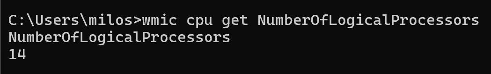
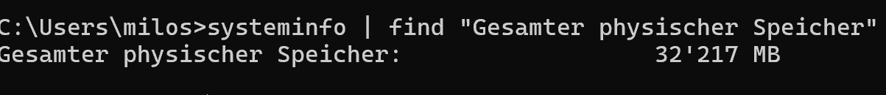

# B) Virtualisierungssoftware – Untersuchung Hypervisor Typ

## Vermutung
Wir nutzen **[Name der Software, z. B. VirtualBox oder VMware Workstation]** auf einem **Windows-Host**.  
Da die Software auf einem bestehenden Betriebssystem läuft, vermuten wir, dass es sich um einen **Hypervisor Typ 2 (Hosted Hypervisor)** handelt.

---

## 1. Host-System prüfen (Windows)

### CPU
Befehl in Windows (CMD):
```cmd
wmic cpu get NumberOfLogicalProcessors


systeminfo | find "Gesamter physischer Speicher"



